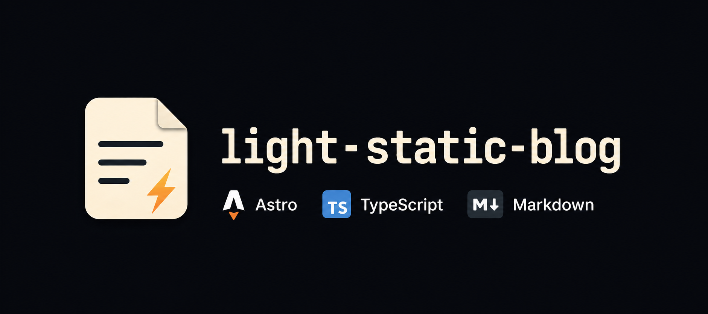

<p align="center">
  
</p>

<p align="center">
  <a href="README.md"> Français</a>
  /
  <a href="README.en.md"> English</a>
</p>

# Light Static Blog

Blog personnel minimaliste avec Astro, TypeScript et Markdown.

## Stack

- Astro
- TypeScript
- Markdown pour les articles
- CSS simple, sans framework frontend lourd

## Architecture et arborescence

Le projet est entièrement statique : Astro transforme les pages et les articles Markdown en fichiers HTML dans `dist/`. Aucun serveur Node, backend, CMS ou base de données n'est nécessaire en production.

```text
.
├── public/                     # Fichiers statiques copiés tels quels
│   ├── images/                 # Couvertures des articles
│   └── scripts/                # Switch clair/sombre minimal, sans dépendance
├── src/
│   ├── components/             # Structure partagée, listes et pagination
│   ├── content.config.ts       # Collections de contenu, loaders et validation du frontmatter
│   ├── config/site.ts          # Identité, thème actif et taille des pages
│   ├── config/tags.ts          # Association optionnelle des tags aux accents visuels
│   ├── content/
│   │   ├── blog/               # Articles Markdown ; le nom devient le slug
│   │   └── pages/              # Pages éditoriales Markdown, dont À propos
│   ├── layouts/
│   │   └── BaseLayout.astro    # Structure HTML commune et SEO
│   ├── lib/                    # Contenu, URL et pagination
│   ├── pages/
│   │   ├── [slug].astro        # Pages des articles
│   │   ├── tags/               # Index et pages de tags
│   │   ├── about.astro
│   │   ├── index.astro         # Première page des articles
│   │   ├── page/[page].astro   # Pages statiques suivantes
│   │   ├── robots.txt.ts       # robots.txt généré avec l'URL du sitemap
│   │   ├── rss.xml.ts          # Flux RSS avec mise en forme CSS légère
│   │   ├── sitemap.xml.ts
│   │   └── styles/
│   │       ├── rss.css.ts      # Feuille CSS appliquée au flux RSS dans un navigateur
│   │       └── theme.css.ts    # Feuille stable composée au build
│   └── themes/
│       ├── registry.ts         # Registre et validation des thèmes
│       ├── shared/             # Fondations et contrats communs
│       ├── default/theme.css   # Thème public par défaut
│       └── <identifiant>/      # Éventuels thèmes supplémentaires
│           ├── theme.css
│           └── assets/         # Polices, images et icônes propres au thème
├── astro.config.mjs            # Build statique et chemin public
├── ARTICLE_TEMPLATE.md         # Modèle pour rédiger un article
├── package.json                # Scripts et dépendances
└── README.md
```

Les articles sont chargés depuis la collection `blog`, triés par date décroissante et filtrés afin d'exclure `draft: true`. Ils sont répartis par pages de six publications. Les composants Astro portent la structure sémantique ; les thèmes ne contiennent que les tokens et règles visuelles.

Le chemin d'hébergement est défini uniquement par `BASE_PATH`. Par exemple, avec `BASE_PATH=/blog/`, l'accueil est publié sous `/blog/` et chaque article sous `/blog/<slug>/`.

Le fichier `robots.txt` est généré au build avec une ligne `Sitemap:` calculée depuis `SITE` et `BASE_PATH`. Les moteurs de recherche le consultent toutefois à la racine de l'hôte, par exemple `https://example.com/robots.txt`. Si le blog est déployé dans un sous-chemin comme `/blog/`, il faut donc aussi déposer le `dist/robots.txt` généré à la racine publique de l'hôte.

## Prérequis

- Node.js 24 LTS
- npm

Les fichiers `.nvmrc` et `.node-version` permettent aux gestionnaires compatibles de sélectionner automatiquement la bonne version de Node.js.

## Installation

```bash
npm install
```

## Développement

```bash
SITE="http://localhost:4321" BASE_PATH="/" AUTHOR_NAME="Nom de l'auteur" SITE_THEME="default" npm run dev
```

Le site est alors disponible sur `http://localhost:4321`.

Sous PowerShell :

```powershell
$env:SITE="http://localhost:4321"
$env:BASE_PATH="/"
$env:AUTHOR_NAME="Nom de l'auteur"
$env:SITE_THEME="default"
npm run dev
```

## Configuration des URL

Trois variables d'environnement sont obligatoires et plusieurs sont optionnelles :

- `SITE` : origine publique du site, sans chemin final, par exemple `https://example.com` ;
- `BASE_PATH` : chemin public terminé par `/`, par exemple `/` ou `/blog/`.
- `AUTHOR_NAME` : nom de l'auteur commun à tous les articles.
- `SITE_THEME` : identifiant du thème construit ; `default` est utilisé par défaut.
- `SITE_NAME` : nom affiché dans la navigation et les titres de pages ; `Light Static Blog` est utilisé par défaut.
- `SITE_HOME_META_TITLE` : balise `<title>` de la page d'accueil ; elle est dérivée de `SITE_NAME` par défaut.
- `SITE_TAGLINE` : signature courte affichée sous le nom du site ; définir une chaîne vide permet de la masquer.
- `SITE_DESCRIPTION` : description SEO utilisée par la home, les métadonnées, le RSS et le sitemap.
- `SITE_SOCIAL_IMAGE` : image Open Graph/Twitter Card par défaut ; par défaut `/images/social-card.png`.
- `SITE_FEED_TITLE` : titre affiché dans les lecteurs RSS ; par défaut `SITE_NAME`.
- `SITE_FEED_DESCRIPTION` : description affichée dans les lecteurs RSS ; par défaut `SITE_DESCRIPTION`.
- `SITE_FEED_ICON` : icône carrée du flux RSS ; par défaut `/images/feed-icon.png`.
- `SITE_FEED_LOGO` : logo utilisé par les lecteurs RSS compatibles Webfeeds ; par défaut `/images/feed-icon.png`.
- `SITE_FEED_ACCENT_COLOR` : couleur d'accent du flux RSS, au format hexadécimal ; par défaut `#f26522`.

Ces valeurs alimentent les liens internes, les URL canonical, les titres, les métadonnées sociales, les données structurées JSON-LD, le flux RSS et le sitemap.

La page d'accueil expose un objet JSON-LD `WebSite`. Chaque article expose un objet `BlogPosting` reprenant son titre, sa description, ses dates, ses tags, son éventuelle couverture et l'auteur défini par `AUTHOR_NAME`.

## Build de production

Exemple pour un site publié sous `https://example.com/blog/` :

```bash
SITE="https://example.com" BASE_PATH="/blog/" AUTHOR_NAME="Nom de l'auteur" SITE_THEME="default" npm run validate
```

Sous PowerShell :

```powershell
$env:SITE="https://example.com"
$env:BASE_PATH="/blog/"
$env:AUTHOR_NAME="Nom de l'auteur"
$env:SITE_THEME="default"
npm run validate
```

La commande `validate` vérifie les types puis génère le site statique dans `dist/`. Pour lancer uniquement la génération :

```bash
npm run build
```

## Ajouter un article

Créer un fichier dans `src/content/blog/`, par exemple `mon-article.md`. Le nom du fichier devient le slug public.

```md
---
title: "Mon titre"
description: "Résumé court"
pubDate: 2026-08-01
updatedDate: 2026-08-02 # optionnel
tags:
  - javascript
  - astro
draft: false
cover: "/images/couverture.png" # optionnel
---

Contenu de l'article en Markdown.
```

- `draft: false` publie l'article.
- `draft: true` l'exclut des pages, des tags, du RSS et du sitemap.
- `cover` référence un fichier placé dans `public/` depuis la racine publique.
- Le flux RSS contient le HTML complet de chaque article dans `content:encoded`. La balise `description` de chaque entrée reste un résumé court. Les couvertures et toutes les images intégrées au contenu y sont publiées avec des URL absolues et des balises Media RSS.
- Les slugs correspondant à une route réservée, comme `about`, `blog` ou `tags`, sont refusés au build.

Le fichier `ARTICLE_TEMPLATE.md` peut servir de point de départ.

## Configurer les couleurs de tags

L'association entre un tag et son accent visuel est définie dans `src/config/tags.ts`.

```ts
export const tagAccents = {
  demo: 'primary',
  latin: 'violet',
  markdown: 'blue',
  methodologie: 'orange',
  projet: 'blue',
};
```

Les accents disponibles sont `primary`, `violet`, `blue` et `orange`. Chaque tag utilisé par un article public doit être déclaré dans `tagAccents` ; sinon le build échoue avec la liste des tags manquants.

## Modifier la page À propos

Le contenu éditorial de la page À propos est stocké dans `src/content/pages/about.md`.

```md
---
title: "À propos"
description: "Présentation courte du projet de blog."
---

Contenu de la page en Markdown.
```

La route `src/pages/about.astro` charge ce fichier, applique le layout commun et utilise son frontmatter pour le titre et la description SEO.

## Thèmes et mode clair/sombre

Le thème est choisi au build avec `SITE_THEME`. Le navigateur peut seulement basculer sa palette claire ou sombre. Sans choix enregistré, le site suit `prefers-color-scheme` ; le switch mémorise ensuite le choix dans `localStorage`. Les pages HTML et le rendu navigateur du RSS chargent `styles/theme.css` et les deux mêmes scripts statiques.

Pour ajouter un thème :

1. Créer `src/themes/<identifiant>/theme.css`.
2. Définir tous les tokens sémantiques utilisés par les composants, dont les palettes claire et sombre via `data-color-mode` et le repli `prefers-color-scheme`.
3. Définir les ressources visuelles propres au thème, par exemple `--color-rss` et `--icon-rss`.
4. Placer les fichiers propres au thème dans `src/themes/<identifiant>/assets/` si nécessaire. Dans `theme.css`, les référencer avec `__THEME_ASSETS__/`, par exemple `url('__THEME_ASSETS__/fonts/ma-police.woff2')`.
5. Lancer `npm run validate` avec `SITE_THEME=<identifiant>` et tester les deux modes, le responsive, RSS et le sitemap XML.

Les thèmes sont découverts automatiquement depuis `src/themes/<identifiant>/theme.css`. Les assets du thème actif sont publiés sous `/theme-assets/<identifiant>/...`, avec le bon préfixe `BASE_PATH`. Une valeur `SITE_THEME` inconnue fait échouer le build avec la liste des thèmes disponibles. Aucun framework frontend ni police distante n'est nécessaire.

## Publier un article

1. Créer l'article dans `src/content/blog/`.
2. Conserver `draft: true` pendant la rédaction.
3. Placer l'éventuelle couverture dans `public/images/`.
4. Relire l'article puis passer `draft` à `false`.
5. Exécuter `npm run validate` avec les valeurs de production de `SITE`, `BASE_PATH` et `AUTHOR_NAME`.
6. Vérifier éventuellement le résultat avec `npm run preview`.
7. Déployer le contenu du dossier `dist/` sur l'hébergement statique.

### Checklist avant publication

- [ ] Le titre et la description correspondent au contenu.
- [ ] `pubDate` est correcte.
- [ ] `updatedDate` n'est renseignée qu'en cas de mise à jour.
- [ ] Les tags utilisés sont déclarés dans `src/config/tags.ts`.
- [ ] La couverture éventuelle existe dans `public/`.
- [ ] `draft: false` est défini.
- [ ] `npm run validate` passe sans erreur.

## Aperçu local du build

Après avoir défini `SITE`, `BASE_PATH` et `AUTHOR_NAME` :

```bash
npm run preview
```

## Déploiement

Le projet est compatible avec tout hébergement capable de servir des fichiers statiques.

1. Définir `SITE`, `BASE_PATH`, `AUTHOR_NAME` et éventuellement `SITE_THEME` avec les valeurs de la cible.
2. Exécuter `npm run validate`.
3. Envoyer le **contenu** de `dist/`, et non le dossier lui-même, vers la racine publique choisie.
4. Si `BASE_PATH` n'est pas `/`, copier aussi le `dist/robots.txt` généré à la racine de l'hôte afin qu'il soit servi depuis `/robots.txt`.
5. Vérifier l'accueil, un article, `rss.xml`, `sitemap.xml` et `robots.txt`.

Le dossier `dist/` est un artefact généré, ignoré par Git et destiné à être reconstruit avant chaque déploiement.

### Déploiement SFTP optionnel

Un script générique est fourni pour les hébergements accessibles en SFTP avec un profil FileZilla local :

```powershell
.\scripts\deploy-sftp.ps1 `
  -Site 'https://example.com' `
  -BasePath '/blog/' `
  -AuthorName "Nom de l'auteur" `
  -SiteName 'Mon blog' `
  -SiteDescription 'Description publique du blog.' `
  -SiteSocialImage '/images/social-card.png' `
  -SiteFeedTitle 'Mon flux RSS' `
  -SiteFeedDescription 'Description du flux RSS.' `
  -SiteFeedIcon '/images/feed-icon.png' `
  -SiteFeedLogo '/images/feed-icon.png' `
  -SiteFeedAccentColor '#f26522' `
  -SftpHost 'ftp.example.com' `
  -RemoteRoot '/remote/path/to/blog' `
  -SyncMode Diff `
  -ExpectedHostKeySha256 'empreinte-sha256-du-serveur'
```

Le script lance le build sauf avec `-SkipBuild`, contrôle RSS/sitemap/canonical/JSON-LD, transfère `dist/`, vérifie les fichiers distants par SHA-256, puis contrôle les URL publiques. Par défaut, `-SyncMode Full` transfère tous les fichiers générés ; `-SyncMode Diff` compare les empreintes SHA-256 distantes et n'envoie que les fichiers absents ou modifiés. La sortie détaillée d'Astro est masquée par défaut pour garder un rendu console propre ; `-VerboseBuild` permet de l'afficher. Si le blog est servi dans un sous-chemin, `-RootRobotsRemotePath` permet aussi de publier `robots.txt` à la racine de l'hôte.

Le script expose les paramètres de personnalisation du blog : site, base path, auteur, nom, titre SEO de l'accueil, tagline, description SEO, image sociale, titre/description/icône/logo/couleur du flux RSS et thème.

## Contraintes

- Pas de backend
- Pas de base de données
- Pas de CMS
- Pas d'API à l'exécution
- JavaScript client limité à des améliorations progressives ; le contenu reste utilisable sans JavaScript

## Commandes utiles

```bash
npm install
npm run optimize:images
SITE="http://localhost:4321" BASE_PATH="/" AUTHOR_NAME="Nom de l'auteur" SITE_THEME="default" npm run dev
SITE="https://example.com" BASE_PATH="/blog/" AUTHOR_NAME="Nom de l'auteur" SITE_THEME="default" npm run validate
SITE="https://example.com" BASE_PATH="/blog/" AUTHOR_NAME="Nom de l'auteur" SITE_THEME="default" npm run preview
```

`npm run optimize:images` génère des variantes WebP depuis les PNG de `public/images/`. Les PNG restent les sources et les fallbacks.
